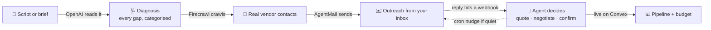
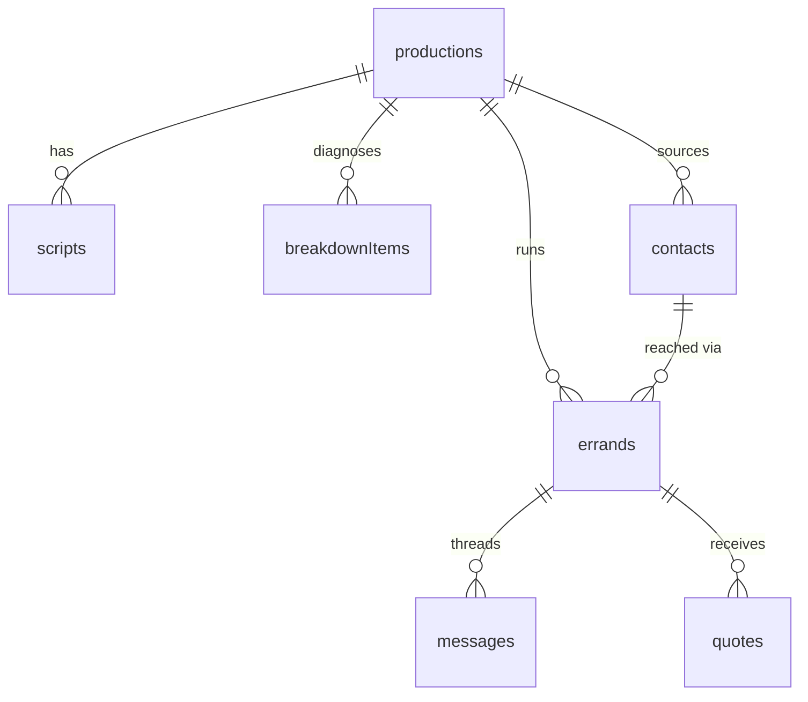

<div align="center">

# 🎬 Callsheet Doctor

### Paste a film script. It diagnoses every production gap and runs the outreach.

An AI production coordinator for filmmakers. It reads a script like a line producer, finds every
location, cast, crew, gear and permit gap, sources real vendors off the open web, and runs the email
outreach from the production's own inbox, all on a live board.

[](https://confident-mule-621.convex.site)
&nbsp;
[](https://convex.dev)
&nbsp;
[](https://www.convex.dev/hackathons/all-gas)


**[▶ Try it as a guest](https://confident-mule-621.convex.site)** — no signup, lands in a workspace preloaded with ten diagnosed productions.

</div>

---

## The problem

Every film starts as a script and a pile of things that do not exist yet: a location nobody booked,
a picture car nobody found, a permit nobody filed. Producers call this the breakdown, and it is a
week of spreadsheets before a single email goes out. Callsheet Doctor does the breakdown and the
outreach for you, and keeps it all moving on its own.

## How it works



1. **Diagnose** — Paste a script, or describe the film in a plain-language brief and let OpenAI write
   a shootable treatment first. Then OpenAI extracts every concrete production need as a categorised,
   scene-referenced breakdown.
2. **Source** — For any gap, Firecrawl searches the web for the right vendor or venue and scrapes a
   real contact email off the page.
3. **Reach out** — The agent drafts a warm, specific email and sends it from the production's own
   AgentMail inbox.
4. **Close** — Replies flow back through a webhook into Convex; the agent reads each one, records the
   quote, negotiates or confirms, and the pipeline moves on its own. A cron nudges anyone who goes
   quiet and gives up politely after three tries.

## The stack, each doing real work

Not a wrapper. Each service does real work in the hot path, verified live on the deployment.

| Service | Role in the hot path | Where |
| --- | --- | --- |
| **Convex** | The entire backend: schema, queries, mutations, actions, HTTP webhooks, cron sweeps, scheduler, and the live subscriptions the dashboard reads from. | `convex/*.ts` |
| **OpenAI** | Writes a script from a brief, breaks the script into needs, drafts every email, reads replies and decides the outcome, extracts the quote. | `convex/breakdown.ts`, `agent.ts` |
| **Firecrawl** | Searches the web per gap and scrapes a real contact email with a JSON schema. | `convex/contacts.ts`, `lib/firecrawl.ts` |
| **AgentMail** | Gives each production a real inbox, sends the outreach, threads the replies, webhooks inbound mail back into Convex. | `convex/lib/agentmail.ts`, `http.ts` |

## Verified live on prod

Every integration was exercised against the live deployment, not just wired up.

| Check | Result |
| --- | --- |
| OpenAI diagnosis | A heist scene returned **10 categorised needs**, including a stunt rigger and a laser-tripwire effect it inferred from the action. |
| OpenAI brief → script | A two-sentence brief produced a slugged **1.9k-char treatment**; diagnosing it returned 40 needs. |
| Firecrawl | Sourced a real vendor email (`rentals@samys.com`) scraped from a live page. |
| AgentMail | Provisioned a real inbox and sent a threaded email (real SES `message_id`). |
| Quote → budget | Accepting a quote moved the budget and auto-confirmed the errand. |
| Auth | Guest access, guest-to-account upgrade keeping all data, and TOTP/passkey password reset all pass. |

## Features

| Area | What you get |
| --- | --- |
| **Onboarding** | One-click guest access, ten preloaded diagnosed productions, a guided tour, guest-to-account upgrade that keeps your work. |
| **Diagnosis** | Paste a script or generate one from a brief; AI breakdown across twelve modules. |
| **Sourcing** | Web search + scrape for real vendor emails, per gap. |
| **Outreach** | Send from a real inbox, AI-drafted replies, in-thread conversation, autonomous follow-ups. |
| **Pipeline** | Six-column kanban, an errand cockpit (reply, set status, accept/reject quotes), live budget. |
| **Auth** | Email/password, anonymous guest, TOTP + passkey (WebAuthn) gated password reset. |
| **Polish** | Light and dark themes, responsive, keyboard-friendly, loading/empty states. |

## Twelve modules, one engine

📍 Locations · 🎭 Cast · 🎬 Crew · 🎥 Gear · 📄 Permits · 🍽️ Catering · ⚖️ Clearance · 🛡️ Insurance · ✈️ Travel · 🏆 Festivals · 📰 Press · 📡 Distribution

One `errands` table discriminated by a `kind` union is the whole engine, so a module is a filter on
`kind`, not a separate table. The agent, the crons and the queries stay uniform across all twelve.

## Data model



`productions`, `scripts`, `breakdownItems`, `contacts`, `errands`, `messages`, `quotes`, plus an
`emailEvents` dedupe log and `mfa` / `resetChallenges` for auth. See `convex/schema.ts`.

## Security and password reset

There is no email password reset. A user resets a forgotten password only by proving a second factor
they enrolled while signed in:

- **TOTP** (authenticator apps): RFC 6238, implemented with Web Crypto in `convex/lib/totp.ts`.
- **Passkeys** (WebAuthn): registration and assertion verification in `convex/lib/webauthn.ts`,
  supporting ES256 and RS256.

Verifying a factor mints a single-use, short-lived token that authorises `modifyAccountCredentials`.

## Develop

```bash
npm install
npm run dev        # convex dev + vite in parallel
npm run typecheck  # tsc --noEmit
npm run build      # vite build
npm run deploy     # build, deploy backend, push static files to Convex hosting
```

The Convex deployment reads these env vars (`npx convex env set`):
`OPENAI_API_KEY`, `OPENAI_BASE_URL`, `OPENAI_MODEL`, `FIRECRAWL_API_KEY`, `AGENTMAIL_API_KEY`, and the
Convex Auth keys `JWT_PRIVATE_KEY` and `JWKS`. Optional resilience: `FALLBACK_OPENAI_BASE_URL`,
`FALLBACK_OPENAI_API_KEY`, `FALLBACK_OPENAI_MODEL`, and `DEMO_INBOX` for a shared demo inbox.

## Licence

See [LICENSE](./LICENSE). Source-available, no-derivatives.
